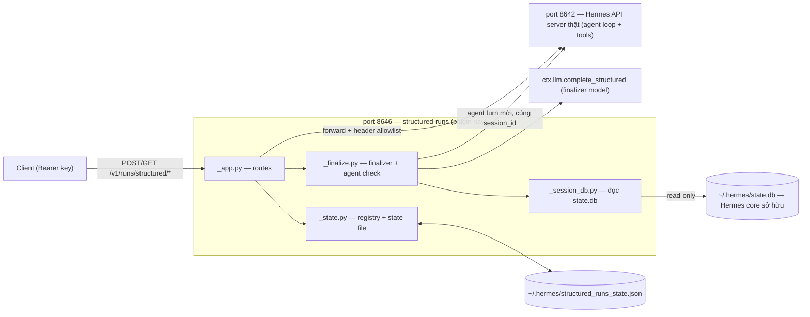
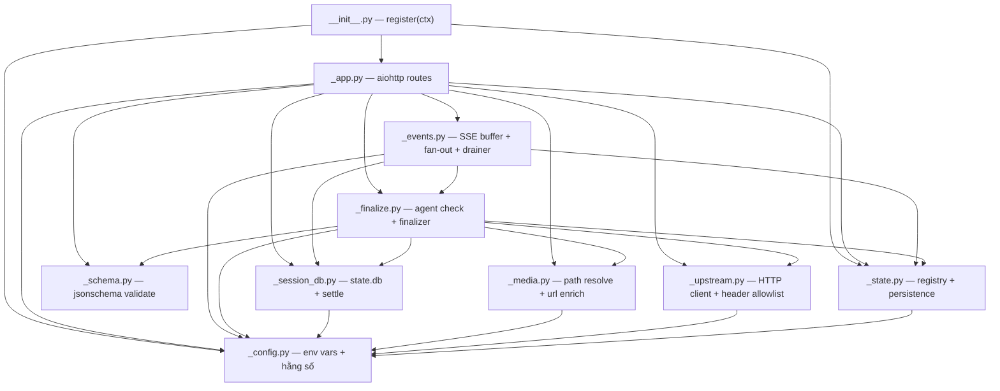
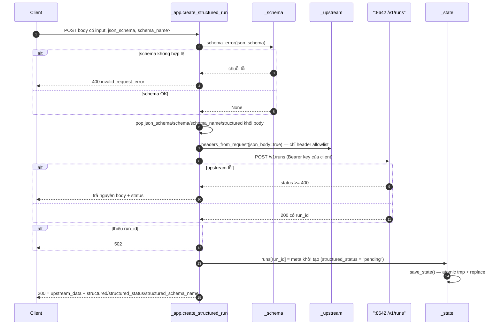
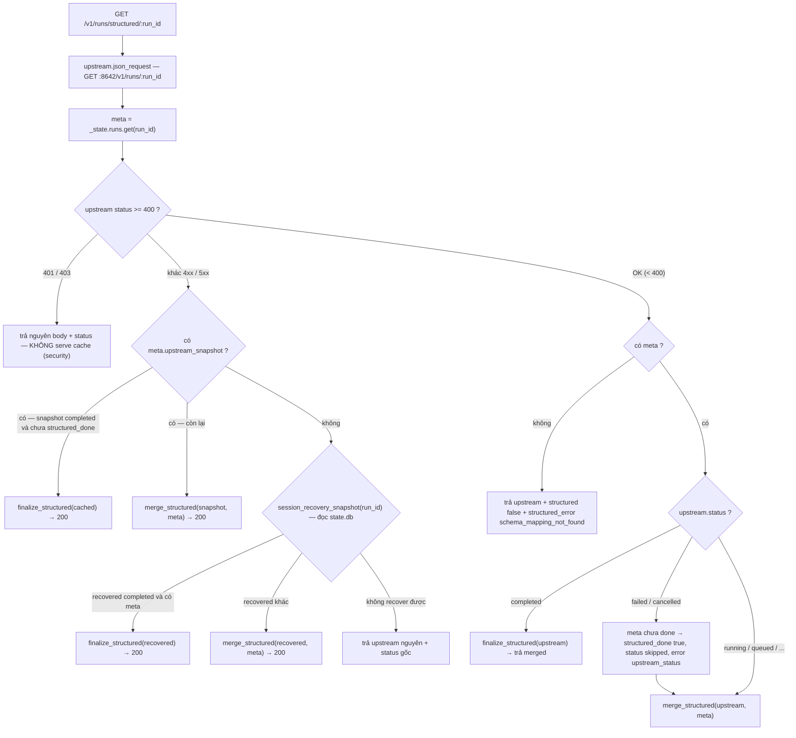
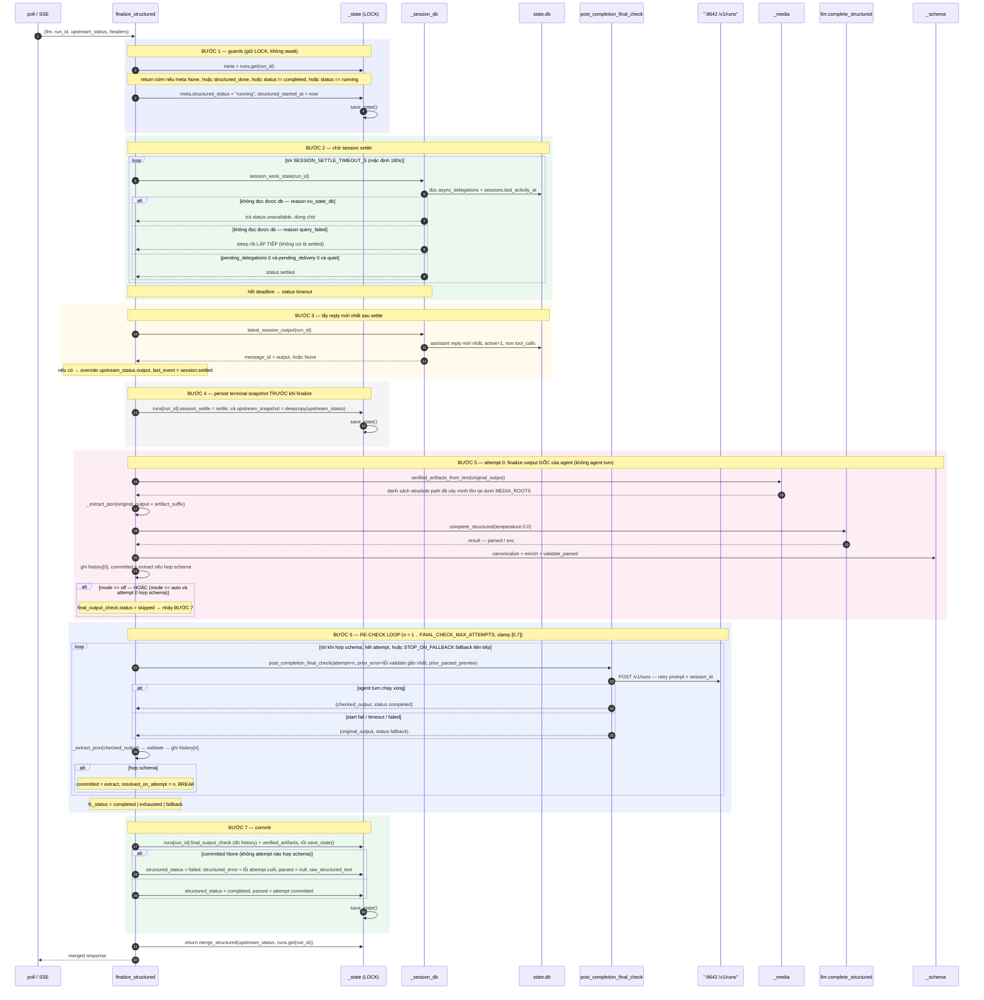
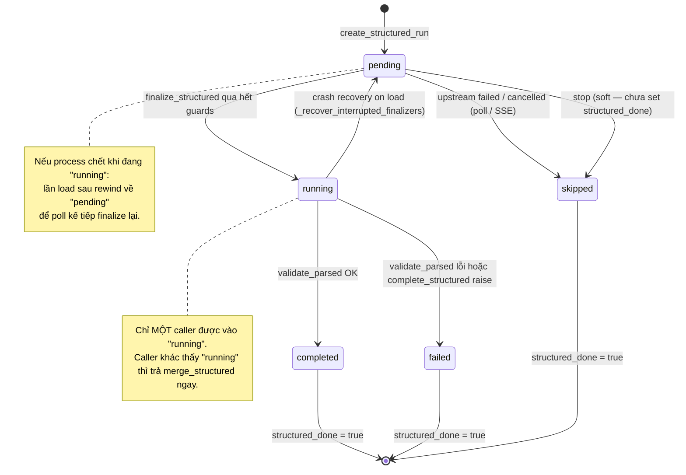
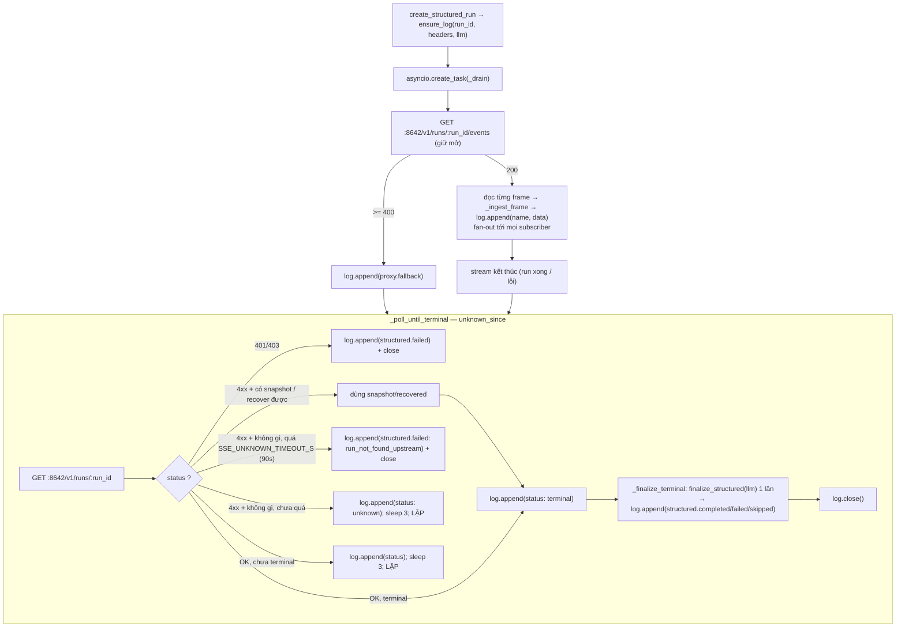
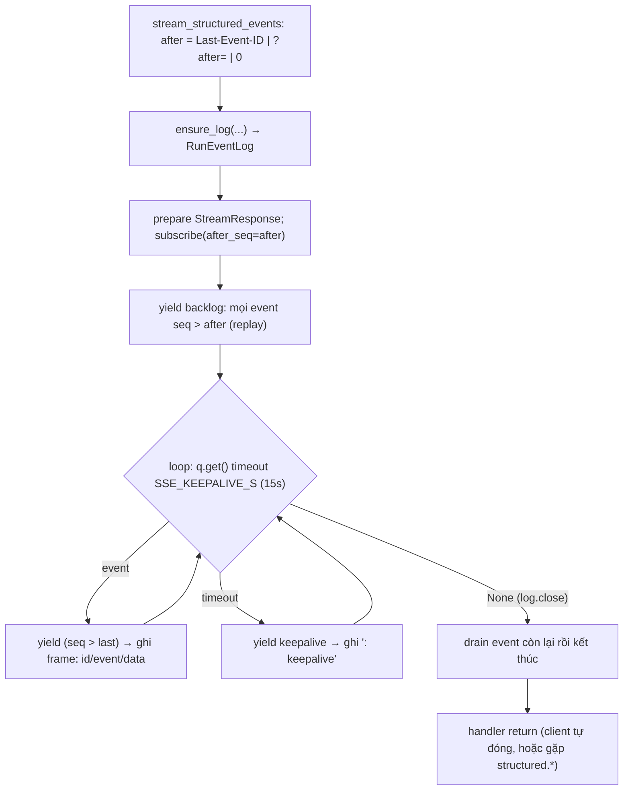
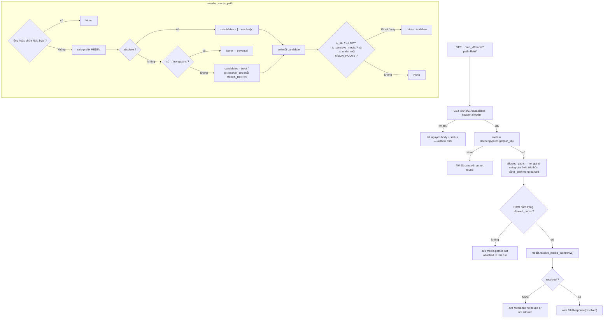
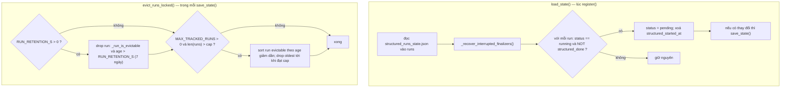

# Structured Runs Plugin — Kiến trúc & luồng xử lý

Tài liệu này mô tả plugin `structured-runs` từ lúc client gửi request đến lúc
nhận `parsed` JSON: từng bước, từng module, kèm mermaid. Đủ chi tiết để viết lại
plugin từ đầu.

> Quy ước: prose bằng tiếng Việt; code / tên định danh / route / env var / tên
> field giữ nguyên tiếng Anh. Trong mermaid dùng `:run_id` thay cho path param
> để tránh vỡ cú pháp.

---

## 1. Plugin này là gì

`structured-runs` là **wrapper HTTP trên port `:8646`**, đứng trước Hermes API
server thật (`:8642`). Nó **không** patch Hermes core — mọi run vẫn chạy qua
agent loop và tool thật của Hermes.

Wrapper chỉ thêm 3 thứ lên trên `/v1/runs`:

1. **Schema finalizer** — sau khi run xong, ép output cuối của agent thành JSON
   đúng `json_schema` client gửi (`llm.complete_structured`).
2. **Post-completion re-check** — khi finalize output gốc không ra JSON hợp
   schema, chạy tới `FINAL_CHECK_MAX_ATTEMPTS` (clamp `[0,7]`) lượt agent *trong
   cùng session* để agent tự sửa, mỗi lượt feed lỗi validate của lượt trước.
3. **Media route** — serve file artifact (video/audio/image/PDF...) có auth,
   chống path traversal.



**Ranh giới trách nhiệm:**

| Wrapper ĐƯỢC làm | Wrapper KHÔNG được làm |
|---|---|
| validate `json_schema` | tự chạy tool |
| forward request kèm header allowlist | tự quyết định nội dung câu trả lời |
| chờ session settle | sửa hành vi agent loop của Hermes |
| chạy post-completion agent check (cùng session) | trả kết quả khi upstream trả `401`/`403` |
| gọi finalizer `llm.complete_structured` | thêm key vào `parsed` mà schema không khai báo |
| enrich media URL, persist terminal snapshot | persist `Authorization` header |

---

## 2. Cấu trúc module

Plugin là một **package thư mục**. Hermes core load `__init__.py` với
`submodule_search_locations` được set (xem `hermes_cli/plugins.py`), nên các
module dưới đây dùng relative import `from . import _foo` bình thường.



| Module | Trách nhiệm | Symbol chính |
|---|---|---|
| `__init__.py` | `register(ctx)`: load state → build app → start thread `:8646` | `register` |
| `_config.py` | Một nguồn sự thật cho mọi env var / path / regex / allowlist | `API_BASE`, `STATE_FILE`, `STATE_DB`, `MEDIA_ROOTS`, `TERMINAL_STATES`, `HEADER_ALLOWLIST`, `_now` |
| `_state.py` | Registry `runs` in-memory + persist JSON; crash recovery; eviction | `runs`, `LOCK`, `load_state`, `save_state`, `evict_runs_locked`, `_recover_interrupted_finalizers` |
| `_session_db.py` | Đọc Hermes `state.db` (read-only); chờ delegation settle | `session_recovery_snapshot`, `session_work_state`, `latest_session_output`, `wait_for_session_settle` |
| `_schema.py` | Validate `json_schema` và `parsed` bằng `jsonschema` (optional dep) | `schema_error`, `validate_parsed`, `validation_available` |
| `_media.py` | Resolve path artifact chống traversal; enrich `*_url` | `resolve_media_path`, `verified_artifacts_from_text`, `canonicalize_artifact_paths`, `enrich_media_urls` |
| `_upstream.py` | HTTP client tới `:8642`; lọc header theo allowlist | `headers_from_request`, `json_request` |
| `_events.py` | Buffer + fan-out SSE per-run; drainer giữ 1 subscription upstream, chạy finalizer khi terminal | `RunEventLog`, `ensure_log`, `get_log`, `_drain`, `_ingest_frame` |
| `_finalize.py` | Post-completion agent check + `complete_structured` finalizer | `finalize_structured`, `post_completion_final_check`, `merge_structured`, `final_output_check_prompt`, `run_output_text` |
| `_app.py` | Toàn bộ route handler + `build_app(ctx)` | `build_app` |

---

## 3. Các endpoint

Spec đầy đủ (request/response schema, ví dụ, cả endpoint hermes-core liên quan):
`docs/openapi.json` — xem bằng `bun run swagger`.

Tất cả nằm trên `:8646`, forward tới `:8642` (`STRUCTURED_RUNS_UPSTREAM`).

| Method | Path | Ý nghĩa |
|---|---|---|
| `POST` | `/v1/runs/structured` | Tạo run Hermes bình thường + đính kèm `json_schema` |
| `GET` | `/v1/runs/structured/:run_id` | Poll; trả `parsed` khi xong |
| `GET` | `/v1/runs/structured/:run_id/events` | SSE stream từ buffer; replay bằng `Last-Event-ID` / `?after=`; emit `structured.*` khi terminal |
| `GET` | `/v1/runs/structured/:run_id/events/log` | Buffer event dạng JSON (fetch phẳng) + structured result hiện tại |
| `GET` | `/v1/runs/structured/:run_id/media?path=...` | Serve artifact (có auth) |
| `POST` | `/v1/runs/structured/:run_id/stop` | Passthrough stop |
| `POST` | `/v1/runs/structured/:run_id/approval` | Passthrough approval |
| `GET` | `/health` | Trạng thái plugin |

---

## 4. Luồng 1 — Tạo run (`POST /v1/runs/structured`)



**Cụ thể:**

- `schema_error` chặn ngay nếu `json_schema` không phải object, `type != "object"`,
  hoặc (khi có `jsonschema`) không phải Draft 2020-12 hợp lệ.
- Body gửi lên upstream được **bỏ** các key wrapper-only (`json_schema`, `schema`,
  `schema_name`, `structured`) — upstream chỉ nhận đúng payload `/v1/runs` chuẩn.
- `HEADER_ALLOWLIST` = `authorization`, `x-hermes-session-id`,
  `x-hermes-session-key`, `idempotency-key`, `accept`, `user-agent`. Không có gì
  khác của request client đi qua ranh giới.
- Metadata lưu vào `runs[run_id]`; **không** lưu header.

meta khởi tạo:

```json
{
  "run_id": "run_xxx",
  "json_schema": { "...": "..." },
  "schema_name": "run.finalizer",
  "created_at": 1788479786.24,
  "structured_done": false,
  "structured_status": "pending"
}
```

---

## 5. Luồng 2 — Poll (`GET /v1/runs/structured/:run_id`)

Đây là nơi cây quyết định phức tạp nhất. Ý tưởng: upstream `/v1/runs` là
**registry in-memory** của Hermes, có thể biến mất (restart, hết retention) trong
khi API session vẫn tồn tại trong `state.db`.



**Bảo mật quan trọng:** khi upstream trả `401`/`403`, wrapper **không bao giờ**
serve `parsed` đã cache. Cache fallback chỉ dành cho trường hợp retention/`404`
*sau khi* caller đã cung cấp API key hợp lệ.

**`session_recovery_snapshot(run_id)`** (trong `_session_db.py`) dựng lại một
object giống `/v1/runs` từ `state.db`:

- đọc `sessions` (id, `ended_at`, tokens, model) + 20 message `assistant` mới nhất;
- bỏ message `Operation interrupted:` (đánh dấu `session_interrupted`);
- bỏ message có `finish_reason == 'tool_calls'` (placeholder tool-call);
- nếu session đã `ended_at` và có nội dung → `status: "completed"` + `output`;
- nếu chưa kết thúc → `status: "unknown"`, `session_active: true`.

---

## 6. Luồng 3 — Finalizer (`finalize_structured`) — TRỌNG TÂM

Hàm `_finalize.finalize_structured(llm, run_id, upstream_status, headers)` được
gọi từ cả poll và SSE khi upstream `completed`. Nó **idempotent** và **an toàn
concurrency**.

### 6.1. Sequence đầy đủ



> **mode**: `auto` (sơ đồ trên) — `always` luôn chạy ít nhất 1 vòng BƯỚC 6 kể cả
> khi attempt 0 hợp schema — `off` commit thẳng attempt 0. Không có `jsonschema`
> thì attempt 0 không thể "hợp schema" nên `auto` luôn vào loop.
>
> `final_output_check` = `{status, reason, recheck_attempts, resolved_on_attempt,
> last_recheck_run_id, history: [{attempt, kind, recheck_run_id, recheck_status,
> outcome: valid|invalid|finalizer_error, validation_error, finalizer_text_preview}]}`.
> `status`: `skipped` | `completed` | `exhausted` (hết attempt) | `fallback`
> (dừng vì agent turn liên tục không chạy được).

### 6.2. Vì sao mỗi bước tồn tại

| Bước | Vấn đề nó giải quyết |
|---|---|
| **1. Guards + `running`** | Hai poll đồng thời (hoặc poll + SSE) không được finalize 2 lần. `structured_done` = đã xong; `structured_status == "running"` = có task khác đang chạy. |
| **2. `wait_for_session_settle`** | `/v1/runs` có thể báo `completed` trong khi `delegate_task` chạy nền vẫn đang deliver kết quả vào cùng session. Finalize ngay = chụp reply cũ. Chờ tới khi `async_delegations` của session này delivered hết + có khoảng lặng (`SESSION_QUIET_S`). **Nếu không đọc được `state.db` thì KHÔNG coi là settled** — chờ tới timeout (tránh finalize trên reply cũ khi DB chỉ lock tạm). |
| **3. `latest_session_output`** | Sau settle, lấy reply `assistant` mới nhất thật sự (bỏ tool-call placeholder), thay cho `output` terminal đầu tiên. |
| **4. persist snapshot** | Hermes giữ run status rất ngắn. Sau restart / hết retention, `/v1/runs/:id` trả `404` trong khi wrapper vẫn còn schema + kết quả. Lưu terminal snapshot để poll vẫn deterministic. |
| **5. attempt 0** | Nếu output agent đã đủ tốt để `complete_structured` cho ra JSON hợp schema thì **không cần** làm phiền agent. `verified_artifacts`: path tương đối phụ thuộc cwd — wrapper resolve sẵn về absolute (đã xác minh tồn tại dưới `MEDIA_ROOTS`) rồi append vào input finalizer / đưa agent như "authoritative". |
| **6. re-check loop** | Khi attempt 0 lệch schema (mode `auto`) hoặc luôn (mode `always`): tối đa `FINAL_CHECK_MAX_ATTEMPTS` (clamp `[0,7]`) lượt agent *thật* trong **cùng `session_id`**, mỗi lượt được feed lỗi validate của lượt trước. Attempt đầu tiên ra JSON hợp lệ được commit. Fail/timeout → fallback output gốc, **không xoá** kết quả hợp lệ. Dừng sớm nếu `STOP_ON_FALLBACK` recheck liên tiếp không chạy được agent turn. **Đánh đổi**: worst case = `MAX_ATTEMPTS` agent turn (vài phút) + `MAX_ATTEMPTS+1` finalizer call + `MAX_ATTEMPTS` cặp message thêm vào session. |
| **7. commit + history** | `temperature=0.0`, không bịa field ngoài schema. `canonicalize`: `*_path` → bare absolute. `enrich`: `*_url` chỉ thêm nếu key đã khai báo. Không `jsonschema` → không fail nhưng `structured_validation: "skipped_no_jsonschema"`. Toàn bộ attempt ghi vào `final_output_check.history`. |

### 6.3. State machine của `structured_status`



---

## 7. Luồng 4 — SSE events (buffer + fan-out)

### 7.1. Vì sao cần buffer

`GET :8642/v1/runs/:run_id/events` của Hermes core là **một `asyncio.Queue`**
per-run:

- 2 subscriber **chia nhau** event (mỗi event chỉ tới 1 người);
- **không replay**, không `Last-Event-ID`;
- queue bị `pop` ngay khi **bất kỳ** handler nào thoát (client disconnect), kể cả
  khi run còn chạy → lần sau `/events` → `404`.

Proxy thẳng cái này = client reconnect mất sạch event, chỉ còn poll `status`.
Wrapper thay bằng: **ngay khi tạo run**, mở **1** subscription upstream duy nhất
(`_events._drain`), drain vào **buffer có bound** (`RunEventLog`). Client đọc từ
buffer.

### 7.2. Drainer (`_events._drain`) — 1 task / run



**Điểm mấu chốt:** finalizer chạy **trong drainer** khi terminal → structured
result được tạo kể cả khi client chỉ dùng SSE rồi disconnect sớm, hoặc **không
connect lần nào**. Poll endpoint vẫn finalize độc lập (idempotent).

### 7.3. `RunEventLog.subscribe(after_seq)` — mỗi client



### 7.4. `GET .../events/log`

Fetch phẳng (không stream): trả `{run_id, closed, upstream_state, next_after,
events: [...], structured: {structured_status, parsed, ...}}`. `?after=<seq>` chỉ
trả event mới hơn. Nếu chưa có log (plugin vừa restart) thì `ensure_log` khởi
động drainer mới.

**Tên event SSE (contract — đổi là breaking):**
`proxy.fallback`, `status`, `structured.completed`, `structured.failed`,
`structured.skipped`; cộng event thô của upstream (`tool.started`,
`tool.completed`, `message.delta`, `reasoning.available`, `run.completed`, ...).

**Bound:** `EVENT_LOG_MAX_EVENTS` / run, giữ `EVENT_LOG_TTL_S` sau khi close,
tối đa `EVENT_LOG_MAX_RUNS` log (drop closed cũ nhất). In-memory — restart mất
event trước đó.

---

## 8. Luồng 5 — Serve media (`GET .../:run_id/media?path=...`)



**`_is_sensitive_media`** — từ chối kể cả khi file nằm dưới root hợp lệ (mặc định
`MEDIA_ROOTS` có `~/.hermes`):

- tên khớp `\.(db|sqlite|sqlite3)(-wal|-shm|-journal)?$` → chặn (không serve
  `state.db` và sidecar);
- resolved path == `STATE_FILE` hoặc `STATE_FILE.tmp` → chặn (không serve
  `structured_runs_state.json` chứa toàn bộ schema + kết quả).

**4 lớp bảo vệ media:** (1) caller phải qua auth upstream; (2) `run_id` phải
known; (3) `path` phải đã đính trong `parsed` như field `*_path`; (4) file resolve
phải nằm dưới `MEDIA_ROOTS` và không phải file nhạy cảm; traversal (`../`,
symlink escape, NUL) bị chặn.

---

## 9. Persistence & recovery

### 9.1. State file

`~/.hermes/structured_runs_state.json`:

```json
{
  "runs": {
    "run_xxx": {
      "run_id": "run_xxx",
      "json_schema": { "type": "object" },
      "schema_name": "run.finalizer",
      "created_at": 1788479786.24,
      "structured_done": true,
      "structured_status": "completed",
      "structured_started_at": 1788479786.24,
      "structured_finished_at": 1788479788.10,
      "structured_validation": "enforced",
      "content_type": "json",
      "structured_model": "gpt-5.5",
      "structured_usage": { "input_tokens": 1, "output_tokens": 2, "total_tokens": 3 },
      "structured_error": null,
      "parsed": { "answer": "42" },
      "session_settle": { "status": "settled", "pending_delegations": 0 },
      "upstream_snapshot": { "status": "completed", "output": "..." },
      "final_output_check": { "status": "skipped", "reason": "first_pass_schema_valid" },
      "verified_artifacts": ["/root/.hermes/media/run_xxx/out.mp4"]
    }
  },
  "updated_at": 1788479788.10
}
```

- **Không bao giờ** persist: `headers`, `Authorization`.
- `save_state()` ghi atomic: `structured_runs_state.tmp` → `os.replace`.
- Mỗi lần `save_state()` gọi `evict_runs_locked()` trước khi serialize.

### 9.2. Crash recovery + eviction



- **`_run_is_evictable(meta)`** = `structured_done` True **hoặc**
  `structured_status` là `completed` / `failed` / `skipped`. Run đang chạy
  (`pending` / `running`) **không bao giờ** bị drop.
- Run bị drop → poll sau đó xử như run lạ:
  `structured_error: "schema_mapping_not_found"`.
- **Crash recovery** cần thiết vì `finalize_structured` set `structured_status =
  "running"` + persist **trước** các bước `await` dài (settle 180s + check 120s +
  finalizer). Process chết trong khoảng này → không recovery thì run kẹt
  `"running"` mãi mãi.

---

## 10. Security model (bất biến khi refactor)

| Rule | Chỗ enforce |
|---|---|
| Mọi call wrapper dùng cùng `Authorization: Bearer` như upstream | `_upstream.headers_from_request` (allowlist) |
| Không trả `parsed` cache khi upstream trả `401`/`403` | `_app.poll_structured_run`, `stream_structured_events` |
| Không persist `Authorization` vào state file | `_state.save_state` (pop `headers`) |
| Media: caller phải có auth hợp lệ | `serve_structured_media` → `GET /v1/capabilities` |
| Media: `run_id` phải known | `serve_structured_media` |
| Media: `path` phải khớp field `*_path` trong `parsed` | `serve_structured_media` (`allowed_paths`) |
| Media: file phải dưới `MEDIA_ROOTS`, không phải file nhạy cảm | `_media.resolve_media_path` + `_is_sensitive_media` |
| Media: chặn `../` traversal, symlink escape, NUL byte | `_media.resolve_media_path` |
| Không thêm key vào `parsed` mà schema không khai báo | `_media.enrich_media_urls` (chỉ sửa key có sẵn) |

---

## 11. Response shape (contract)

`GET /v1/runs/structured/:run_id` khi `completed` — do `merge_structured` dựng:

```json
{
  "object": "hermes.run",
  "run_id": "run_xxx",
  "status": "completed",
  "output": "raw output cuối của agent (đã qua settle + check)",

  "structured": true,
  "structured_status": "completed",
  "parsed": { "answer": "42" },
  "content_type": "json",
  "structured_model": "gpt-5.5",
  "structured_usage": { "input_tokens": 1, "output_tokens": 2, "total_tokens": 3 },
  "structured_error": null,
  "structured_schema_name": "run.finalizer",
  "structured_validation": "enforced",
  "final_output_check": {
    "status": "completed",
    "reason": null,
    "recheck_attempts": 1,
    "resolved_on_attempt": 1,
    "last_recheck_run_id": "run_yyy",
    "history": [
      { "attempt": 0, "kind": "agent_output",  "outcome": "invalid", "validation_error": "..." },
      { "attempt": 1, "kind": "agent_recheck", "recheck_run_id": "run_yyy", "recheck_status": "completed", "outcome": "valid" }
    ]
  },
  "session_settle": { "status": "settled" },
  "verified_artifacts": ["/root/.hermes/media/run_xxx/out.mp4"]
}
```

`final_output_check.status`: `skipped` (attempt 0 đạt schema hoặc `mode=off`) ·
`completed` (một re-check ra JSON hợp lệ) · `exhausted` (hết `MAX_ATTEMPTS`) ·
`fallback` (agent turn liên tục không chạy được). Mọi field mới thêm phải đi qua
`merge_structured`. Đổi tên field / event / route là **breaking change**.

---

## 12. Env var reference (`_config.py`)

| Variable | Default | Ý nghĩa |
|---|---|---|
| `STRUCTURED_RUNS_UPSTREAM` | `http://127.0.0.1:8642` | Hermes API server thật |
| `HERMES_HOME` | `~/.hermes` | Nơi có `state.db` + state file |
| `STRUCTURED_RUNS_MAX_OUTPUT_CHARS` | `200000` | Giới hạn raw output đưa vào finalizer |
| `STRUCTURED_RUNS_FINAL_CHECK_MODE` | `auto` | `auto` = re-check khi cần; `always` = ít nhất 1 re-check/run; `off` = không bao giờ |
| `STRUCTURED_RUNS_FINAL_CHECK_MAX_ATTEMPTS` | `3` | Số re-check agent turn tối đa (attempt 0 không tính). **Clamp `[0, 7]`** |
| `STRUCTURED_RUNS_FINAL_CHECK_STOP_ON_FALLBACK` | `2` | Dừng loop sau ngần này re-check fallback liên tiếp (`0` = tắt) |
| `STRUCTURED_RUNS_FINAL_CHECK_TEXT_PREVIEW_CHARS` | `500` | Độ dài `finalizer_text_preview` mỗi history entry |
| `STRUCTURED_RUNS_FINAL_CHECK_TIMEOUT_S` | `120` | Thời gian tối đa cho lượt agent check |
| `STRUCTURED_RUNS_FINAL_CHECK_POLL_INTERVAL_S` | `1` | Nhịp poll lượt check |
| `STRUCTURED_RUNS_SESSION_SETTLE_TIMEOUT_S` | `180` | Chờ tối đa cho delegation của session settle |
| `STRUCTURED_RUNS_SESSION_QUIET_S` | `3` | Khoảng lặng cần có sau khi delegation deliver |
| `STRUCTURED_RUNS_SESSION_SETTLE_POLL_INTERVAL_S` | `1` | Nhịp check delegation state |
| `STRUCTURED_RUNS_SSE_UNKNOWN_TIMEOUT_S` | `90` | Grace trước khi drainer bỏ cuộc cho run không tồn tại |
| `STRUCTURED_RUNS_SSE_KEEPALIVE_S` | `15` | Nhịp `: keepalive` trên stream `/events` |
| `STRUCTURED_RUNS_EVENT_LOG_MAX_EVENTS` | `3000` | Số event buffer tối đa / run |
| `STRUCTURED_RUNS_EVENT_LOG_TTL_S` | `600` | Giữ buffer bao lâu sau khi run close (cho replay trễ) |
| `STRUCTURED_RUNS_EVENT_LOG_MAX_RUNS` | `500` | Số run có buffer tối đa (drop closed cũ nhất) |
| `STRUCTURED_RUNS_STATE_DB_BUSY_TIMEOUT_S` | `5` | SQLite busy timeout khi đọc `state.db` |
| `STRUCTURED_RUNS_RETENTION_S` | `604800` (7 ngày) | Run finished cũ hơn ngần này bị drop. `0` = tắt |
| `STRUCTURED_RUNS_MAX_TRACKED` | `2000` | Cap số run tracked; drop oldest finished. `0` = tắt |
| `STRUCTURED_RUNS_MEDIA_ROOTS` | `/root/motion-graphic-templete,/root/.hermes,/tmp` | Root cho phép serve media |

---

## 13. Viết lại plugin từ đầu — checklist

1. **`plugin.yaml`**: `name`, `version`, `provides_commands: []`.
2. **`__init__.py`**: `register(ctx)` → `_state.load_state()` → `_app.build_app(ctx)`
   → spawn daemon thread chạy `web.TCPSite(runner, "0.0.0.0", 8646)` trên event
   loop riêng. Không làm gì ở module level.
3. **`_config.py`**: đọc hết env var một lần. Regex `MEDIA_PATH_RE`,
   `SENSITIVE_MEDIA_RE`. `MEDIA_ROOTS` resolve sẵn. `_now()`.
4. **`_state.py`**: `runs` dict + `LOCK` (`threading.RLock`). `load_state` →
   `_recover_interrupted_finalizers`. `save_state` atomic + `evict_runs_locked`.
   Không persist `headers`.
5. **`_upstream.py`**: `headers_from_request` (chỉ `HEADER_ALLOWLIST`).
   `json_request` dùng một `ClientSession` pooled, timeout per-request.
6. **`_session_db.py`**: `_connect_state_db` (busy timeout). `_state_db` context
   manager (yield None nếu db vắng). `session_recovery_snapshot`,
   `session_work_state` (phân biệt `no_state_db` / `query_failed`),
   `latest_session_output`, `wait_for_session_settle`.
7. **`_schema.py`**: import `jsonschema` optional. `schema_error`,
   `validate_parsed`, `validation_available`.
8. **`_media.py`**: `resolve_media_path` (NUL → strip MEDIA: → absolute/relative
   → `..` check → resolve → `is_file` + `_is_sensitive_media` + `_is_under`).
   `verified_artifacts_from_text`, `canonicalize_artifact_paths`,
   `enrich_media_urls` (chỉ sửa `*_url` có sẵn & rỗng).
9. **`_finalize.py`**: `final_output_check_prompt` (tiếng Việt — cố ý),
   `run_output_text`, `merge_structured`, `_extract_json` (một lượt finalizer,
   không đụng registry), `post_completion_final_check(attempt, prior_error)`,
   `finalize_structured` (7 bước ở §6: attempt 0 + re-check loop tối đa 7 theo
   `FINAL_CHECK_MODE` / `FINAL_CHECK_MAX_ATTEMPTS`, ghi `final_output_check.history`).
   `finalize_structured` nhận `llm` làm tham số, không đóng closure trên `ctx`.
10. **`_events.py`**: `RunEventLog` (buffer + `_subs` fan-out + `subscribe(after_seq)`
    có keepalive), `ensure_log(run_id, headers, llm)` (idempotent, 1 drainer/run),
    `_drain` → `_ingest_frame` → `_poll_until_terminal` → `_finalize_terminal`
    (gọi `finalize_structured` khi terminal). `_gc_logs` bound theo TTL + cap.
11. **`_app.py`**: `build_app(ctx)` định nghĩa các handler + đăng ký router.
    `create_structured_run` gọi `events.ensure_log` để bắt event từ t0;
    `stream_structured_events` chỉ relay `log.subscribe`.
12. **Tests** (`tests/_plugin.py` là loader chung mô phỏng Hermes core:
    `spec_from_file_location(..., submodule_search_locations=[dir])` +
    `__package__` + `sys.modules[...]`).

### Bất biến không được phá

- Idempotency + concurrency của finalizer: `LOCK`, cờ `structured_done` /
  `structured_status == "running"`, persist terminal snapshot **trước** khi
  finalize.
- Security model ở §10.
- Tên route / tên event SSE / response shape / schema state file.
- Prompt tiếng Việt gửi cho Hermes agent/finalizer — **không** dịch sang tiếng
  Anh (phục vụ người dùng Việt). Comment code xung quanh vẫn tiếng Anh.
- Không patch/thay Hermes core; run luôn chạy qua agent loop + tool thật.
