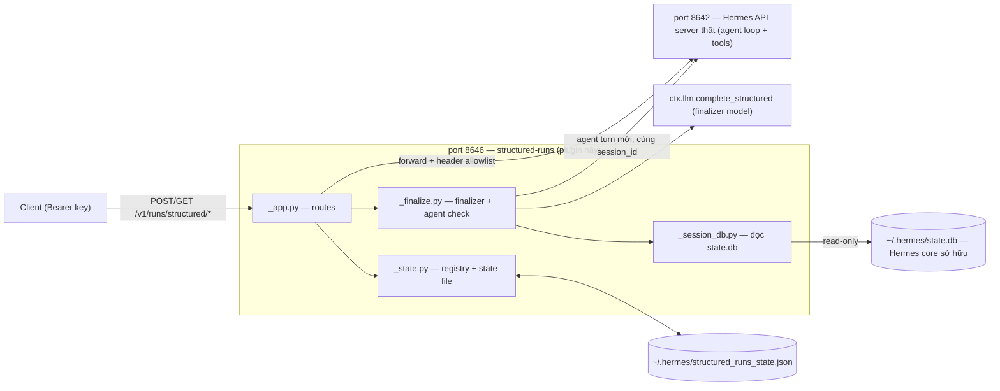
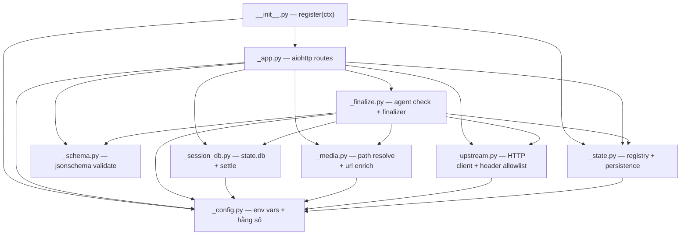
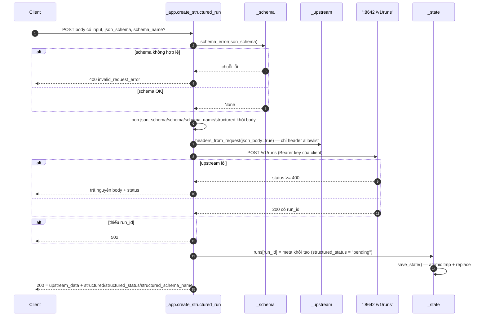
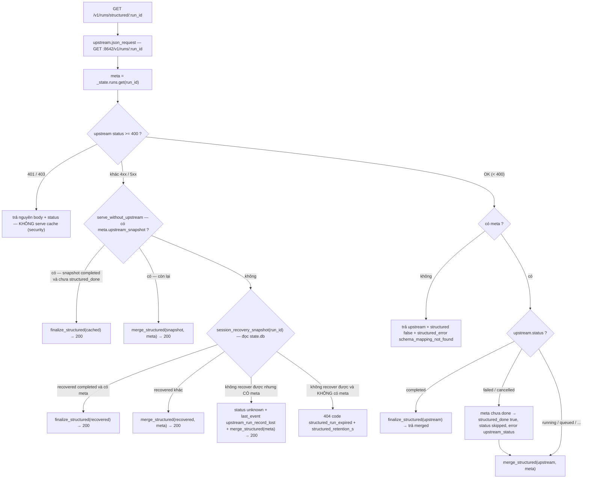
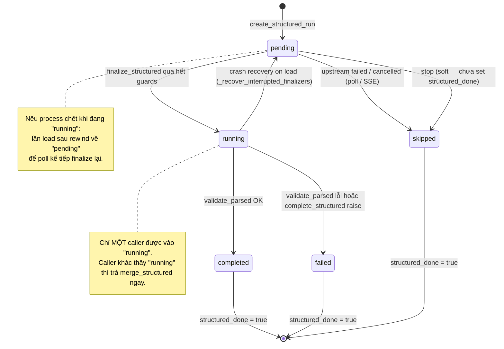
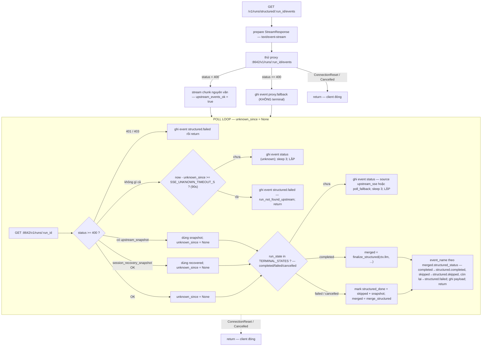
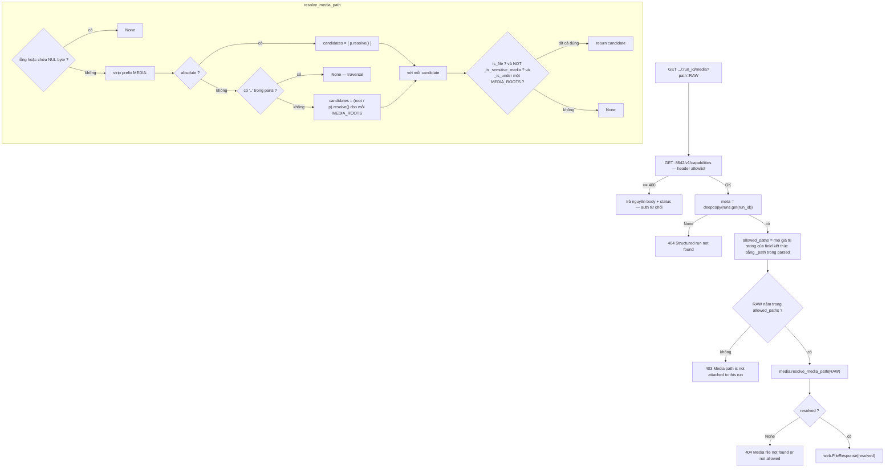
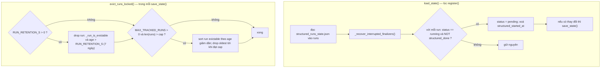

# Structured Runs Plugin — Kiến trúc & luồng xử lý

Tài liệu này mô tả plugin `structured-runs` từ lúc client gửi request đến lúc
nhận `parsed` JSON: từng bước, từng module, kèm mermaid. Đủ chi tiết để viết lại
plugin từ đầu.

> Quy ước: prose bằng tiếng Việt; code / tên định danh / route / env var / tên
> field giữ nguyên tiếng Anh. Trong mermaid dùng `:run_id` thay cho path param
> để tránh vỡ cú pháp.

---

## 1. Plugin này là gì

`structured-runs` là **wrapper HTTP trên port `:8646`**, đứng trước Hermes API
server thật (`:8642`). Nó **không** patch Hermes core — mọi run vẫn chạy qua
agent loop và tool thật của Hermes.

Wrapper chỉ thêm 3 thứ lên trên `/v1/runs`:

1. **Schema finalizer** — sau khi run xong, ép output cuối của agent thành JSON
   đúng `json_schema` client gửi (`llm.complete_structured`).
2. **Post-completion agent check** — một lượt agent bổ sung *trong cùng session*
   để agent tự sửa câu trả lời cuối theo schema. Mặc định (`auto`) chỉ chạy khi
   finalize output gốc của agent không ra JSON hợp schema.
3. **Media route** — serve file artifact (video/audio/image/PDF...) có auth,
   chống path traversal.



**Ranh giới trách nhiệm:**

| Wrapper ĐƯỢC làm | Wrapper KHÔNG được làm |
|---|---|
| validate `json_schema` | tự chạy tool |
| forward request kèm header allowlist | tự quyết định nội dung câu trả lời |
| chờ session settle | sửa hành vi agent loop của Hermes |
| chạy post-completion agent check (cùng session) | trả kết quả khi upstream trả `401`/`403` |
| gọi finalizer `llm.complete_structured` | thêm key vào `parsed` mà schema không khai báo |
| enrich media URL, persist terminal snapshot | persist `Authorization` header |

---

## 2. Cấu trúc module

Plugin là một **package thư mục**. Hermes core load `__init__.py` với
`submodule_search_locations` được set (xem `hermes_cli/plugins.py`), nên các
module dưới đây dùng relative import `from . import _foo` bình thường.



| Module | Trách nhiệm | Symbol chính |
|---|---|---|
| `__init__.py` | `register(ctx)`: load state → build app → start thread `:8646` | `register` |
| `_config.py` | Một nguồn sự thật cho mọi env var / path / regex / allowlist | `API_BASE`, `STATE_FILE`, `STATE_DB`, `MEDIA_ROOTS`, `TERMINAL_STATES`, `HEADER_ALLOWLIST`, `_now` |
| `_state.py` | Registry `runs` in-memory + persist JSON; crash recovery; eviction | `runs`, `LOCK`, `load_state`, `save_state`, `evict_runs_locked`, `_recover_interrupted_finalizers`, `mark_finalizer_failed`, `finalizer_is_stale` |
| `_session_db.py` | Đọc Hermes `state.db` (read-only); chờ delegation settle | `session_recovery_snapshot`, `session_work_state`, `latest_session_output`, `wait_for_session_settle` |
| `_schema.py` | Validate `json_schema` và `parsed` bằng `jsonschema` (optional dep) | `schema_error`, `validate_parsed`, `validation_available` |
| `_media.py` | Resolve path artifact chống traversal; enrich `*_url` | `resolve_media_path`, `verified_artifacts_from_text`, `canonicalize_artifact_paths`, `enrich_media_urls` |
| `_upstream.py` | HTTP client tới `:8642`; lọc header theo allowlist | `headers_from_request`, `json_request` |
| `_finalize.py` | Post-completion agent check + `complete_structured` finalizer; background task luôn kết thúc terminal | `finalize_structured`, `_claim_finalizer`, `_run_finalizer`, `_finalize_once`, `post_completion_final_check`, `merge_structured`, `final_output_check_prompt`, `run_output_text` |
| `_app.py` | Toàn bộ route handler + `build_app(ctx)` | `build_app` |

---

## 3. Các endpoint

Tất cả nằm trên `:8646`, forward tới `:8642` (`STRUCTURED_RUNS_UPSTREAM`).

| Method | Path | Ý nghĩa |
|---|---|---|
| `POST` | `/v1/runs/structured` | Tạo run Hermes bình thường + đính kèm `json_schema` |
| `GET` | `/v1/runs/structured/:run_id` | Poll; trả `parsed` khi xong |
| `GET` | `/v1/runs/structured/:run_id/events` | Proxy SSE; fallback polling; emit `structured.*` khi terminal |
| `GET` | `/v1/runs/structured/:run_id/media?path=...` | Serve artifact (có auth) |
| `POST` | `/v1/runs/structured/:run_id/stop` | Passthrough stop |
| `POST` | `/v1/runs/structured/:run_id/approval` | Passthrough approval |
| `GET` | `/health` | Trạng thái plugin |

---

## 4. Luồng 1 — Tạo run (`POST /v1/runs/structured`)



**Cụ thể:**

- `schema_error` chặn ngay nếu `json_schema` không phải object, `type != "object"`,
  hoặc (khi có `jsonschema`) không phải Draft 2020-12 hợp lệ.
- Body gửi lên upstream được **bỏ** các key wrapper-only (`json_schema`, `schema`,
  `schema_name`, `structured`) — upstream chỉ nhận đúng payload `/v1/runs` chuẩn.
- `HEADER_ALLOWLIST` = `authorization`, `x-hermes-session-id`,
  `x-hermes-session-key`, `idempotency-key`, `accept`, `user-agent`. Không có gì
  khác của request client đi qua ranh giới.
- Metadata lưu vào `runs[run_id]`; **không** lưu header.

meta khởi tạo:

```json
{
  "run_id": "run_xxx",
  "json_schema": { "...": "..." },
  "schema_name": "run.finalizer",
  "created_at": 1788479786.24,
  "structured_done": false,
  "structured_status": "pending"
}
```

---

## 5. Luồng 2 — Poll (`GET /v1/runs/structured/:run_id`)

Đây là nơi cây quyết định phức tạp nhất. Ý tưởng: upstream `/v1/runs` là
**registry in-memory** của Hermes, có thể biến mất (restart, hết retention) trong
khi API session vẫn tồn tại trong `state.db`.



**Bảo mật quan trọng:** khi upstream trả `401`/`403`, wrapper **không bao giờ**
serve `parsed` đã cache. Cache fallback chỉ dành cho trường hợp retention/`404`
*sau khi* caller đã cung cấp API key hợp lệ.

**Run đang được wrapper theo dõi không bao giờ bị trả `404`.** Registry `/v1/runs`
của Hermes biến mất rất sớm sau khi run xong; nếu wrapper cũng trả `404` thì client
mất luôn kết quả structured đã hoàn thành. Chỉ run mà **wrapper cũng đã quên** mới
trả `404`, và trả kèm `code: "structured_run_expired"` + `structured_retention_s`
để client phân biệt "hết retention" với "sai run id".

**`session_recovery_snapshot(run_id)`** (trong `_session_db.py`) dựng lại một
object giống `/v1/runs` từ `state.db`:

- đọc `sessions` (id, `ended_at`, tokens, model) + 20 message `assistant` mới nhất;
- bỏ message `Operation interrupted:` (đánh dấu `session_interrupted`);
- bỏ message có `finish_reason == 'tool_calls'` (placeholder tool-call);
- nếu session đã `ended_at` và có nội dung → `status: "completed"` + `output`;
- nếu chưa kết thúc → `status: "unknown"`, `session_active: true`.

---

## 6. Luồng 3 — Finalizer (`finalize_structured`) — TRỌNG TÂM

Hàm `_finalize.finalize_structured(llm, run_id, upstream_status, headers, *, wait_s)`
được gọi từ cả poll và SSE khi upstream `completed`. Nó **idempotent** và **an toàn
concurrency**.

Công việc finalize chạy trong **background task thuộc event loop của plugin**
(`_finalize._TASKS`), không thuộc request đã khởi động nó. `wait_s` chỉ giới hạn
thời gian *caller chờ* (poll: `POLL_FINALIZE_WAIT_S`; SSE: `None` = chờ tới cùng),
và `asyncio.shield` bảo đảm hết thời gian chờ — hoặc client ngắt kết nối giữa
chừng — **không** hủy được task. Đây chính là lỗi cũ: client Rails timeout →
handler bị cancel → run kẹt vĩnh viễn ở `structured_status: "running"`.

**Bất biến:** một run `completed` luôn kết thúc ở trạng thái terminal
(`completed` / `failed` / `skipped`), không bao giờ ở `running` mà không có ai xử lý.
Mọi nhánh thoát của `_run_finalizer` đều ghi trạng thái terminal: exception →
`structured_finalizer_error: ...`; quá `FINALIZER_MAX_RUNTIME_S` →
`structured_finalizer_timeout`; loop shutdown → rewind về `pending` cho lần poll sau.

### 6.1. Sequence đầy đủ

```mermaid
sequenceDiagram
    autonumber
    participant CALLER as poll / SSE
    participant F as finalize_structured
    participant ST as _state (LOCK)
    participant SDB as _session_db
    participant DB as state.db
    participant PC as post_completion_final_check
    participant UP as ":8642 /v1/runs"
    participant M as _media
    participant LLM as llm.complete_structured
    participant SC as _schema

    CALLER->>F: (llm, run_id, upstream_status, headers)

    rect rgb(235,238,252)
    note over F,ST: BƯỚC 1 — _claim_finalizer (giữ LOCK, không await)
    F->>ST: meta = runs.get(run_id)
    Note over F,ST: không claim nếu meta None / structured_done / status != completed / đang "running" và CHƯA stale
    Note over F,ST: "running" đã quá FINALIZER_STALE_AFTER_S = chủ cũ đã chết → reclaim; quá FINALIZER_MAX_ATTEMPTS → failed terminal
    F->>ST: structured_attempts += 1, structured_status = "running", structured_started_at = now
    F->>ST: upstream_snapshot = upstream_status (persist NGAY, trước mọi await)
    ST->>ST: save_state()
    end

    rect rgb(235,248,238)
    note over F,DB: BƯỚC 2 — chờ session settle
    loop tới SESSION_SETTLE_TIMEOUT_S (mặc định 180s)
        F->>SDB: session_work_state(run_id)
        SDB->>DB: đọc async_delegations + sessions.last_activity_at
        alt không đọc được db — reason no_state_db
            SDB-->>F: trả status unavailable, dừng chờ
        else không đọc được db — reason query_failed
            SDB-->>F: sleep rồi LẶP TIẾP (không coi là settled)
        else pending_delegations 0 và pending_delivery 0 và quiet
            SDB-->>F: status settled
        end
    end
    Note over SDB,F: hết deadline → status timeout
    end

    rect rgb(255,250,235)
    note over F,DB: BƯỚC 3 — lấy reply mới nhất sau settle
    F->>SDB: latest_session_output(run_id)
    SDB->>DB: assistant reply mới nhất, active=1, non tool_calls
    SDB-->>F: message_id + output, hoặc None
    Note over F: nếu có → override upstream_status.output, last_event = session.settled
    end

    rect rgb(244,244,244)
    note over F,ST: BƯỚC 4 — persist terminal snapshot TRƯỚC khi finalize
    F->>ST: runs[run_id].session_settle = settle, và upstream_snapshot = deepcopy(upstream_status)
    ST->>ST: save_state()
    end

    rect rgb(253,238,244)
    note over F,SC: BƯỚC 5 — fast path (mode auto/off): thử finalize output GỐC của agent
    F->>M: verified_artifacts_from_text(original_output)
    M-->>F: danh sách absolute path đã xác minh tồn tại dưới MEDIA_ROOTS
    F->>F: _extract_json(original_output + artifact_suffix)
    F->>LLM: complete_structured(temperature 0.0) qua asyncio.to_thread
    LLM-->>F: result — parsed, text, model, usage
    F->>M: canonicalize_artifact_paths + enrich_media_urls
    F->>SC: validate_parsed(parsed, schema)
    alt mode == off, HOẶC (jsonschema có và validation_error is None)
        Note over F: first_pass_ok — final_output_check = status skipped<br/>KHÔNG chạy agent re-check → nhảy tới BƯỚC 7
    end
    end

    rect rgb(235,242,253)
    note over F,UP: BƯỚC 6 — escalate: chỉ chạy khi first pass KHÔNG đạt schema (mode auto) hoặc mode always
    F->>PC: post_completion_final_check(run_id, upstream_status, schema, headers, verified_artifacts)
    PC->>UP: POST /v1/runs — input là final_output_check_prompt, cùng session_id
    alt start fail
        PC-->>F: (original_output, status fallback)
    else poll GET /v1/runs/:check_run_id tới FINAL_CHECK_TIMEOUT_S (120s)
        alt completed và output non-empty
            PC-->>F: (checked_output, status completed)
        else completed rỗng / failed / cancelled / timeout
            PC-->>F: (original_output, status fallback)
        end
    end
    F->>F: _extract_json(checked_output + artifact_suffix) — finalize lần 2
    F->>LLM: complete_structured
    LLM-->>F: result
    end

    rect rgb(235,248,238)
    note over F,ST: BƯỚC 7 — commit kết quả
    F->>ST: runs[run_id].final_output_check + verified_artifacts, rồi save_state()
    Note over F,ST: structured_validation = "enforced" | "skipped_no_jsonschema"
    alt exc (complete_structured raise)
        F->>ST: structured_status failed, structured_error = str(exc)
    else validation_error
        F->>ST: structured_status failed, structured_error, parsed None, raw_structured_text
    else OK
        F->>ST: structured_status completed, parsed = parsed
    end
    ST->>ST: save_state()
    end

    F->>ST: return merge_structured(upstream_status, runs.get(run_id))
    F-->>CALLER: merged response (hoặc "running" nếu caller đã hết wait_s — task vẫn chạy tiếp)
```

> `STRUCTURED_RUNS_FINAL_CHECK_MODE`: `auto` (mặc định, sơ đồ trên) — `always`
> bỏ BƯỚC 5, luôn chạy BƯỚC 6 — `off` chạy BƯỚC 5 rồi commit thẳng (không bao
> giờ BƯỚC 6). Không có `jsonschema` thì first pass không thể "đạt schema" nên
> `auto` luôn escalate.

### 6.2. Vì sao mỗi bước tồn tại

| Bước | Vấn đề nó giải quyết |
|---|---|
| **1. `_claim_finalizer` + `running`** | Hai poll đồng thời (hoặc poll + SSE) không được finalize 2 lần. `structured_done` = đã xong; `structured_status == "running"` = có task khác đang chạy. Claim persist `upstream_snapshot` **ngay lập tức** vì Hermes có thể xóa run record chỉ vài giây sau khi completed — snapshot chụp muộn hơn sẽ mất trắng output vào `404 run_not_found`. Claim `running` quá cũ (`FINALIZER_STALE_AFTER_S`) là của process đã chết nên được reclaim, nhưng chỉ tối đa `FINALIZER_MAX_ATTEMPTS` lần rồi fail hẳn. |
| **2. `wait_for_session_settle`** | `/v1/runs` có thể báo `completed` trong khi `delegate_task` chạy nền vẫn đang deliver kết quả vào cùng session. Finalize ngay = chụp reply cũ. Chờ tới khi `async_delegations` của session này delivered hết + có khoảng lặng (`SESSION_QUIET_S`). **Nếu không đọc được `state.db` thì KHÔNG coi là settled** — chờ tới timeout (tránh finalize trên reply cũ khi DB chỉ lock tạm). |
| **3. `latest_session_output`** | Sau settle, lấy reply `assistant` mới nhất thật sự (bỏ tool-call placeholder), thay cho `output` terminal đầu tiên. |
| **4. persist snapshot** | Hermes giữ run status rất ngắn. Sau restart / hết retention, `/v1/runs/:id` trả `404` trong khi wrapper vẫn còn schema + kết quả. Lưu terminal snapshot để poll vẫn deterministic. |
| **5. fast path** | Nếu output agent đã đủ tốt để `complete_structured` cho ra JSON hợp schema thì **không cần** làm phiền agent thêm một lượt. Tiết kiệm nguyên một agent turn (tới 120s + tool + token). `verified_artifacts`: path tương đối phụ thuộc cwd — wrapper resolve sẵn về absolute (đã xác minh file tồn tại dưới `MEDIA_ROOTS`) và append vào input finalizer / đưa cho agent như "authoritative". |
| **6. escalate** | Chỉ khi first pass **không** hợp schema (mode `auto`), hoặc luôn (mode `always`): một lượt agent *thật* trong **cùng `session_id`** để agent tự rà theo schema và sửa. Fail/timeout → fallback về output gốc, **không bao giờ xoá** kết quả hợp lệ. Rồi finalize lại lần 2. |
| **7. `complete_structured`** | Bước tạo JSON cuối. `temperature=0.0`. Không bịa field ngoài schema. `canonicalize`: `*_path` → bare absolute path. `enrich`: `*_url` chỉ thêm nếu schema/finalizer đã khai báo key đó. `validate_parsed`: không có `jsonschema` → không fail run nhưng `structured_validation: "skipped_no_jsonschema"` + log warning. |

### 6.3. State machine của `structured_status`



---

## 7. Luồng 4 — SSE events (`GET .../:run_id/events`)



**Tên event SSE (contract — đổi là breaking):**
`proxy.fallback`, `status`, `structured.completed`, `structured.failed`,
`structured.skipped`.

**Vì sao có poll-fallback:** buffer SSE của Hermes có thể không có sẵn cho run
chạy lâu. Không được emit `structured.failed` giả chỉ vì stream lỗi — phải poll
`/v1/runs/:id` tới khi terminal thật. Nhưng nếu run **hoàn toàn không tồn tại**
(cả registry lẫn session), sau `SSE_UNKNOWN_TIMEOUT_S` mới bỏ cuộc.

---

## 8. Luồng 5 — Serve media (`GET .../:run_id/media?path=...`)



**`_is_sensitive_media`** — từ chối kể cả khi file nằm dưới root hợp lệ (mặc định
`MEDIA_ROOTS` có `~/.hermes`):

- tên khớp `\.(db|sqlite|sqlite3)(-wal|-shm|-journal)?$` → chặn (không serve
  `state.db` và sidecar);
- resolved path == `STATE_FILE` hoặc `STATE_FILE.tmp` → chặn (không serve
  `structured_runs_state.json` chứa toàn bộ schema + kết quả).

**4 lớp bảo vệ media:** (1) caller phải qua auth upstream; (2) `run_id` phải
known; (3) `path` phải đã đính trong `parsed` như field `*_path`; (4) file resolve
phải nằm dưới `MEDIA_ROOTS` và không phải file nhạy cảm; traversal (`../`,
symlink escape, NUL) bị chặn.

---

## 9. Persistence & recovery

### 9.1. State file

`~/.hermes/structured_runs_state.json`:

```json
{
  "runs": {
    "run_xxx": {
      "run_id": "run_xxx",
      "json_schema": { "type": "object" },
      "schema_name": "run.finalizer",
      "created_at": 1788479786.24,
      "structured_done": true,
      "structured_status": "completed",
      "structured_started_at": 1788479786.24,
      "structured_finished_at": 1788479788.10,
      "structured_validation": "enforced",
      "content_type": "json",
      "structured_model": "gpt-5.5",
      "structured_usage": { "input_tokens": 1, "output_tokens": 2, "total_tokens": 3 },
      "structured_error": null,
      "parsed": { "answer": "42" },
      "session_settle": { "status": "settled", "pending_delegations": 0 },
      "upstream_snapshot": { "status": "completed", "output": "..." },
      "final_output_check": { "status": "skipped", "reason": "first_pass_schema_valid" },
      "verified_artifacts": ["/root/.hermes/media/run_xxx/out.mp4"]
    }
  },
  "updated_at": 1788479788.10
}
```

- **Không bao giờ** persist: `headers`, `Authorization`.
- `save_state()` ghi atomic: `structured_runs_state.tmp` → `os.replace`.
- Mỗi lần `save_state()` gọi `evict_runs_locked()` trước khi serialize.

### 9.2. Crash recovery + eviction



- **`_run_is_evictable(meta)`** = `structured_done` True **hoặc**
  `structured_status` là `completed` / `failed` / `skipped`. Run đang chạy
  (`pending` / `running`) **không bao giờ** bị drop.
- Run bị drop → poll sau đó xử như run lạ:
  `structured_error: "schema_mapping_not_found"`.
- **Crash recovery** cần thiết vì `finalize_structured` set `structured_status =
  "running"` + persist **trước** các bước `await` dài (settle 180s + check 120s +
  finalizer). Process chết trong khoảng này → không recovery thì run kẹt
  `"running"` mãi mãi.

---

## 10. Security model (bất biến khi refactor)

| Rule | Chỗ enforce |
|---|---|
| Mọi call wrapper dùng cùng `Authorization: Bearer` như upstream | `_upstream.headers_from_request` (allowlist) |
| Không trả `parsed` cache khi upstream trả `401`/`403` | `_app.poll_structured_run`, `stream_structured_events` |
| Không persist `Authorization` vào state file | `_state.save_state` (pop `headers`) |
| Media: caller phải có auth hợp lệ | `serve_structured_media` → `GET /v1/capabilities` |
| Media: `run_id` phải known | `serve_structured_media` |
| Media: `path` phải khớp field `*_path` trong `parsed` | `serve_structured_media` (`allowed_paths`) |
| Media: file phải dưới `MEDIA_ROOTS`, không phải file nhạy cảm | `_media.resolve_media_path` + `_is_sensitive_media` |
| Media: chặn `../` traversal, symlink escape, NUL byte | `_media.resolve_media_path` |
| Không thêm key vào `parsed` mà schema không khai báo | `_media.enrich_media_urls` (chỉ sửa key có sẵn) |

---

## 11. Response shape (contract)

`GET /v1/runs/structured/:run_id` khi `completed` — do `merge_structured` dựng:

```json
{
  "object": "hermes.run",
  "run_id": "run_xxx",
  "status": "completed",
  "output": "raw output cuối của agent (đã qua settle + check)",

  "structured": true,
  "structured_status": "completed",
  "parsed": { "answer": "42" },
  "content_type": "json",
  "structured_model": "gpt-5.5",
  "structured_usage": { "input_tokens": 1, "output_tokens": 2, "total_tokens": 3 },
  "structured_error": null,
  "structured_schema_name": "run.finalizer",
  "structured_validation": "enforced",
  "final_output_check": { "status": "skipped", "reason": "first_pass_schema_valid" },
  "session_settle": { "status": "settled" },
  "verified_artifacts": ["/root/.hermes/media/run_xxx/out.mp4"]
}
```

`final_output_check.status` có thể là: `skipped` (fast path đạt schema, hoặc mode
`off`), `completed` (agent re-check chạy xong), `fallback` (agent re-check
lỗi/timeout → giữ output gốc). Mọi field mới thêm phải đi qua `merge_structured`.
Đổi tên field / event / route là **breaking change** — phải nêu rõ và migrate.

---

## 12. Env var reference (`_config.py`)

| Variable | Default | Ý nghĩa |
|---|---|---|
| `STRUCTURED_RUNS_UPSTREAM` | `http://127.0.0.1:8642` | Hermes API server thật |
| `HERMES_HOME` | `~/.hermes` | Nơi có `state.db` + state file |
| `STRUCTURED_RUNS_MAX_OUTPUT_CHARS` | `200000` | Giới hạn raw output đưa vào finalizer |
| `STRUCTURED_RUNS_FINAL_CHECK_MODE` | `auto` | `auto` = chỉ chạy agent re-check khi first-pass không hợp schema; `always` = luôn chạy (legacy); `off` = không bao giờ |
| `STRUCTURED_RUNS_FINAL_CHECK_TIMEOUT_S` | `120` | Thời gian tối đa cho lượt agent check |
| `STRUCTURED_RUNS_FINAL_CHECK_POLL_INTERVAL_S` | `1` | Nhịp poll lượt check |
| `STRUCTURED_RUNS_SESSION_SETTLE_TIMEOUT_S` | `180` | Chờ tối đa cho delegation của session settle |
| `STRUCTURED_RUNS_SESSION_QUIET_S` | `3` | Khoảng lặng cần có sau khi delegation deliver |
| `STRUCTURED_RUNS_SESSION_SETTLE_POLL_INTERVAL_S` | `1` | Nhịp check delegation state |
| `STRUCTURED_RUNS_SSE_UNKNOWN_TIMEOUT_S` | `90` | Grace trước khi SSE bỏ cuộc cho run không tồn tại |
| `STRUCTURED_RUNS_STATE_DB_BUSY_TIMEOUT_S` | `5` | SQLite busy timeout khi đọc `state.db` |
| `STRUCTURED_RUNS_RETENTION_S` | `604800` (7 ngày) | Run finished cũ hơn ngần này bị drop. `0` = tắt |
| `STRUCTURED_RUNS_MAX_TRACKED` | `2000` | Cap số run tracked; drop oldest finished. `0` = tắt |
| `STRUCTURED_RUNS_MEDIA_ROOTS` | `/root/motion-graphic-templete,/root/.hermes,/tmp` | Root cho phép serve media |

---

## 13. Viết lại plugin từ đầu — checklist

1. **`plugin.yaml`**: `name`, `version`, `provides_commands: []`.
2. **`__init__.py`**: `register(ctx)` → `_state.load_state()` → `_app.build_app(ctx)`
   → spawn daemon thread chạy `web.TCPSite(runner, "0.0.0.0", 8646)` trên event
   loop riêng. Không làm gì ở module level.
3. **`_config.py`**: đọc hết env var một lần. Regex `MEDIA_PATH_RE`,
   `SENSITIVE_MEDIA_RE`. `MEDIA_ROOTS` resolve sẵn. `_now()`.
4. **`_state.py`**: `runs` dict + `LOCK` (`threading.RLock`). `load_state` →
   `_recover_interrupted_finalizers`. `save_state` atomic + `evict_runs_locked`.
   Không persist `headers`.
5. **`_upstream.py`**: `headers_from_request` (chỉ `HEADER_ALLOWLIST`).
   `json_request` dùng một `ClientSession` pooled, timeout per-request.
6. **`_session_db.py`**: `_connect_state_db` (busy timeout). `_state_db` context
   manager (yield None nếu db vắng). `session_recovery_snapshot`,
   `session_work_state` (phân biệt `no_state_db` / `query_failed`),
   `latest_session_output`, `wait_for_session_settle`.
7. **`_schema.py`**: import `jsonschema` optional. `schema_error`,
   `validate_parsed`, `validation_available`.
8. **`_media.py`**: `resolve_media_path` (NUL → strip MEDIA: → absolute/relative
   → `..` check → resolve → `is_file` + `_is_sensitive_media` + `_is_under`).
   `verified_artifacts_from_text`, `canonicalize_artifact_paths`,
   `enrich_media_urls` (chỉ sửa `*_url` có sẵn & rỗng).
9. **`_finalize.py`**: `final_output_check_prompt` (tiếng Việt — cố ý),
   `run_output_text`, `merge_structured`, `_extract_json` (một lượt finalizer,
   không đụng registry), `post_completion_final_check`, `finalize_structured`
   (7 bước ở §6, với fast-path/escalate theo `FINAL_CHECK_MODE`).
   `finalize_structured` nhận `llm` làm tham số, không đóng closure trên `ctx`.
10. **`_app.py`**: `build_app(ctx)` định nghĩa 7 handler + đăng ký router. Handler
    gọi `finalize.finalize_structured(ctx.llm, ...)`.
11. **Tests** (`tests/_plugin.py` là loader chung mô phỏng Hermes core:
    `spec_from_file_location(..., submodule_search_locations=[dir])` +
    `__package__` + `sys.modules[...]`).

### Bất biến không được phá

- Idempotency + concurrency của finalizer: `LOCK`, cờ `structured_done` /
  `structured_status == "running"`, persist terminal snapshot **trước** khi
  finalize.
- Security model ở §10.
- Tên route / tên event SSE / response shape / schema state file.
- Prompt tiếng Việt gửi cho Hermes agent/finalizer — **không** dịch sang tiếng
  Anh (phục vụ người dùng Việt). Comment code xung quanh vẫn tiếng Anh.
- Không patch/thay Hermes core; run luôn chạy qua agent loop + tool thật.
